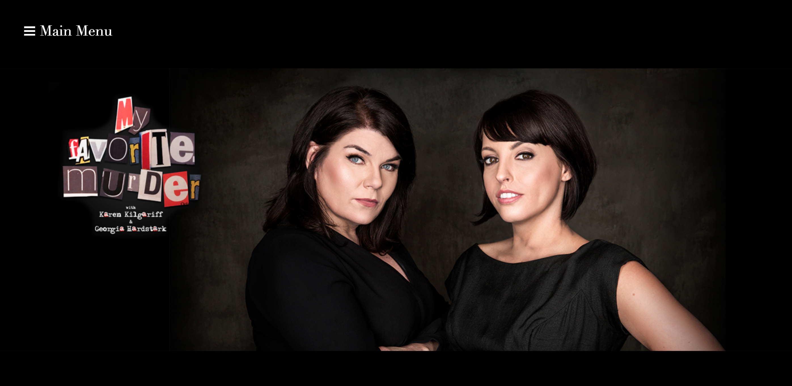
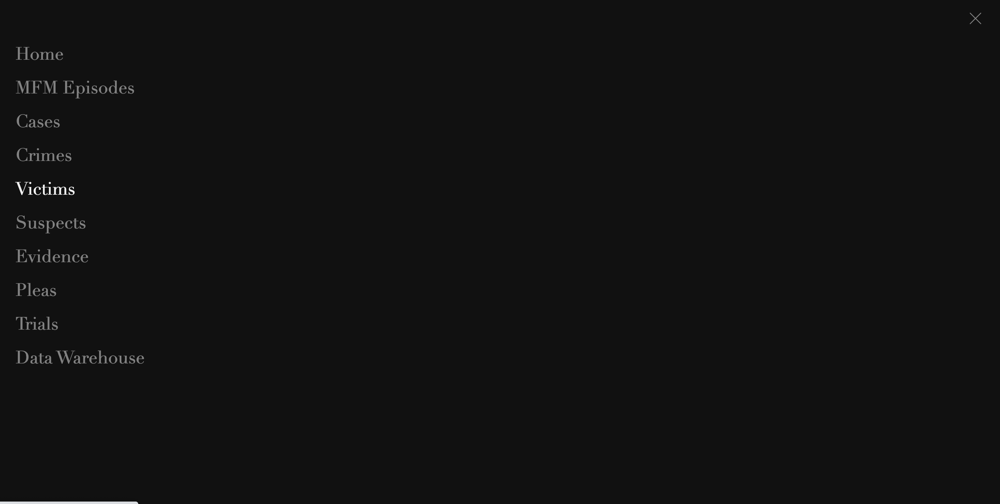
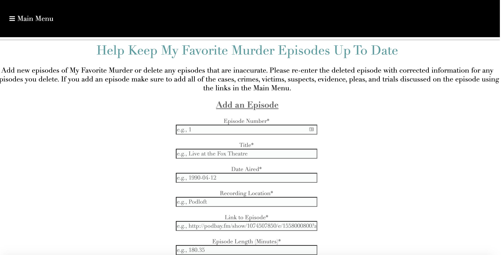
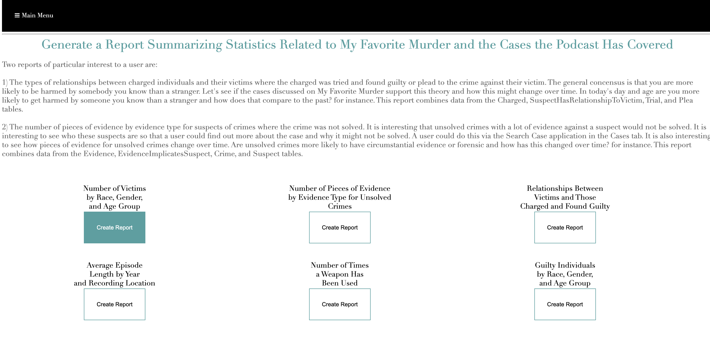
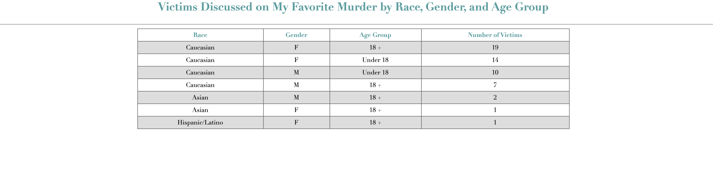

# My Favorite Murder: The Database

## Description
My Favorite Murder is a podcast where each week the two hosts tell the story of a murder. The hosts, in the beginning, would forget which murders they had already covered, which sometimes led to the re-telling of a murder. This database was created for the purpose of being able to track which cases were already covered. Users can add or remove information on the murders already covered by the podcast including the episode details, the case name, crimes, suspects, victims, trials, evidence, and more. There are then search functions to learn more about the details of cases. Finally, there are summary statistics for the types of cases covered. One of the purposes of creating this web app was to observe what types of victims had their stories told. The hosts of the podcast often talk about the fact that if the victim isn't a white woman the story is not known. Or that if the victim is a POC or a sex worker, the case is not given as much attention. This is the idea of the "Less Dead." Yet, if you look at the cases covered by the podcast, the hosts predominantly speak about the murders of white women. 

## Stack
The app has a MySQL database to store the data entered and retrieved from the web interface. The database was created using the GUI MySQL Workbench. The web app's Javascript code calls to PHP code that pulls from the database. This was deployed using AWS's RDS and EC2 server. It lives at mfmthedatabase.com. 

## Lessons Learned
This project taught me about database best practices such as locks and stored procedures. This was also the first web app I ever deployed, so I gained substantial exposure to web development.

I created this app before I knew anything about web development. Therefore, there is unecessary HTML and CSS that could have been streamlined and made to look better with Bootstrap and other intrinsic functions of HTML. Additionally, the displayed results are not asethically pleasing. If I were to redo this project I would create decorative, visual displays to present the data. 
